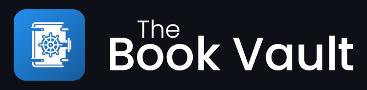

# Book Vault



## Table of Contents

1. [Description](#description-📖)
2. [Folder structure](#folder-structure-📂)
3. [How to run](#how-to-run-⚙️)
4. [Pages](#pages-📃)
5. [Design](#design-🖌️)
6. [Sustainability](#sustainability-🌱)
7. [Dataset](#dataset-📚)
8. [Test coverage](#test-coverage-🧪)
9. [Tech stack](#tech-stack-🛠️)
10. [Reduced scope](#reduced-scope-🔍)
11. [How to contribute](#how-to-contribute-🤝)

## Description 📖

Book Vault is a comprehensive web-based book catalogue, with close to 40 thousand literary works. It is built with modern web technologies, offering an intuitive interface for discovering, tracking, and reviewing books. On it you can browse books of different genres, length, publishers and whatever else you would want to filter your selection by. You can leave reviews on books you have read, and view other people's reviews to make informed decisions about which books to read next. The application is designed to be accessible and sustainable, with a focus on user experience and performance.

### Key Features

- **Extensive Catalog**: Browse through our collection of close to 40,000 books.

- **Community Engagement**:

  - Rate books on a 5-star scale ⭐
  - See the distribution of ratings for each book
  - Write and share your own detailed reviews 📜
    - These can be edited
  - Read community reviews to discover new reads 📖

- **Personalization**:

  - Automatically create a user for you
    - The created user has a 🤸fun 🤸 username that consists of a random combination between a word from our "Nouns" database collection, and our "Adjectives" database collection.
    - You can change your name if it is not to your liking
    - Once the account is created, the user gets a UUID and a secret placed in their localstorage. These are used for authentication
  - Track books you've read and books you want to read by adding them to your library
  - See your own reviews 📜

- **User Experience**:

  - Responsive design that works across all devices 📱💻
  - Minimalistic and modern interface providing an intuitive user experience
  - Efficient pagination for smooth browsing
  - Fast search and filtering capabilities 🔍
  - Dark mode for reduced eye strain 🌙

- **Advanced Selection Options**:

  - Search:

    - Search by titles and descriptions 📰
    - Debounced Search 🔍

  - Sort books by:

    - Book title 📙
    - Author name 🧑‍🏫
    - Publisher name 🏢

  - Filter books by:

    - Publishers 🏢
    - Authors 🧑‍🏫
    - Average rating ⭐
    - Year published
    - Number of pages 📃
    - Genres 🧙‍♂️

  - See how many books are in each selection when applying filters and disallow filtering by attributes that would result in no books.

## Folder structure 📂

We are using a monorepo structure with both frontend and backend in the same repository.

## How to run ⚙️

Before doing anything else, you have to clone the repository:

```
git clone https://git.ntnu.no/IT2810-H24/T05-Project-2.git
```

### Frontend

To start with the frontend, you need to run the following commands:

```
cd frontend
npm install
npm run dev
```

### Backend

[Click here to go to the tutorial on how to run the backend locally](/backend/README.md)

## Virtual Machine

The application is running on a VM at [http://it2810-05.idi.ntnu.no/project2](http://it2810-05.idi.ntnu.no/project2)

## Pages 📃

TODO: Show figma stuff

### Home page

This is our home page. From this page you can navigate to all other pages, as well as view a random book, or view books in popular genres.

This page- like every other page, has a darkmode version that can be enabled by clicking the moon icon in the top right.

|  |  |
| :------------------------------: | :------------------------------------------------: |
|          The home-page           |        The home-page with dark-mode enabled        |

### Booklist page

On this page you can browse and filter books.

You can search by title and description.

You can filter results by

- Publisher
- Author
- Minimum rating
- Year published
- Number of pages
- Genre

After applying a filter you will get an updated account on the amount of results you currently have from your filter options, as well as accounts on how that number will change by further applying filters.

You can also sort the results in either ascending or descending order by either the books name, the authors name, or by the publishers name.

|  |
| :-----------------------------------: |
|           The booklist page           |

### Book-info page

On this page you can view more info about a book, like average rating, description, genres, ...

|  |
| :------------------------------------: |
|           The book-info page           |

You can add the book to your library by adding it to either your _"Reading list"_ or "_Have read list_".

|     |                     |
| :-------------------------------------------------: | :------------------------------------------------------------: |
| A book that has not been added to any of your lists | A book that has been added to the lists of books you have read |

You can also leave a review of the book, as well as view other people's reviews. A common response we got from the reviwers of our second delivery was that it wasnt clear enough that your review affected the average rating. We solved this by adding a rating-count next to the average rating, as well as a statistic of how many people gave each rating.

|                                              |
| :------------------------------------------------------------------------------------------: |
|               Before bad review. Notice how there are 40 038 "1-star" ratings                |
|                                                 |
|                                    Writing the bad review                                    |
|                                                |
| After the bad review. Notice how there are now 40 039 "1-star" ratings, one more than before |

You can also leave reviews without descriptions. These will just act as normal ratings, and will not show up to others as a review, but will be counted as a part of the rating statistics.

|  |
| :---------------------------------------------------: |
|             A review without description              |

### Profile page

Here you can view your recent library activity; which books you want to read and which you have read. You can also view your most recent reviews.

If you have more than three books marked as want to read, a "View all" button will show up, which takes you to the rest of the books you want to read on the ["Books you want to read"-page](#library-pages). The same is true for the books you have read, and for your reviews.

|  |
| :-------------------------------------: |
|            The profile page             |

On your profile page you can also change your name. Below you can see the name go from "Squooshy Volcano" to "The Great Guy".

|  |  |
| :---------------------------------------------------------: | :--------------------------------------------: |
|                   Name change in progress                   |                Name change done                |

### Reviews page

Here you can view all the reviews you have left on books. The reviews will be shortened down if they are too long. To read the full reviews you can click on them and read them on their respective book-info pages.

We were suprised when one of our reviewers thought that the possibility of creating a review without a review-description was a bug, and that we should limit the user to only be able to create reviews whenever a description has been filled out. To make it clearer that you are supposed to be able to create reviews consisting of only ratings we created distinct styles for these types of reviews. For example; on the reviews page, reviews without a review-description has bigger stars to compensate for the open space.

|                                                                                                                                   |
| :----------------------------------------------------------------------------------------------------------------------------------------------------------------------------------: |
| The reviews page with reviews. Notice how the description is cut off for the review with a long review-description, and that the stars are larger on the book without a description. |

### Library pages

On the "want to read"-list page you can view all the books you have marked as "want to read".
On the "have read"-list page you can view all the books you have marked as "have read".

|  |  |
| :----------------------------------------: | :---------------------------------------------: |
|        Page for books you have read        |         Page for books you want to read         |

### Testing page

This page is only available through [adding /testing to the url when you are on the homepage or by clicking this link](http://it2810-05.idi.ntnu.no/project2/testing). This page is meant for our testers.

**Example test made easier by this page:**

> You want to make sure new users can create reviews

> You want to look at how multiple reviews looks on a book-info page

|  |
| :----------------------------------: |
|           The testing page           |

## Design 🖌️

### Theme

During the development of this website, we explored various themes to find the most suitable design. Initially, we adopted a dark blue theme inspired by our first logo. However, this theme did not integrate well with the overall aesthetic of the website, leading to a mix of inconsistent themes. Additionally, the original logo contained excessive detail, which we attempted to simplify, but the results were not convincing.

Therefore, we experimented with several new themes, including a beige color scheme intended to evoke a book-like feel. Unfortunately, this theme did not align with the minimalistic design we aimed for and would require a lot of work to change Mantine's light theme and would go against adviced practices with Mantine. Ultimately, we selected a vibrant blue color that complements our minimalistic design approach. To add visual interest, we incorporated a gradient into the theme.

|  |  |
| :-----------------------------------------------------------------: | :--------------------------------------------------------------: |
|                              Old Logo                               |                             New Logo                             |

We also support a light theme and a dark theme. The default theme is based on the user's system preferences, but the user can change the theme manually. Since we support both themes, we have been careful to use colors that work well in both themes and adhere to WCAG guidelines.

### Images 🖼️

The images used on this website were created using DALL-E 3 and Bing Image Creator. These tools generate images that are not subject to copyright restrictions and can be used freely. Since the generated images were not perfect, we utilized the GIMP image editor to adjust them to better fit our website's design. Additionally, to adhere to sustainable web design principles, we compressed the images using the WebP format, with PNG as a fallback for browsers that do not support WebP. The images for the book covers are from Goodreads, we also use [Placehold.co](https://placehold.co/200x300?text=Cover%20image%20for%20book) for fallbacks.

### Accessibility and Universal Design 🌍

We have made an effort to make our application as accessible as possible.

The Mantine UI library follows the Accessible Rich Internet Applications Suite (WAI-ARIA) accessibility guidelines. To further increase accessibility, we have added aria-attributes to the relevant components. We also follow the Web Content Accessibility Guidelines (WCAG) to ensure that our website is accessible to all users. The website should be usable to all people, regardless of their abilities.

We have also strived to make it intuitive to interact with our application, putting a lot of focus into having intuitive buttons and a user-friendly layout and behavior.

We have prioritized universal design to ensure that our solution is usable for everyone, eliminating the need for separate or specialized solutions. Examples on accessibility accommodations:

- Sight impaired:
  - Support for screen readers
  - WCAG 2.1 compliant color contrast between text and background
  - Scalable text
  - Website is zoomable
- Hearing:
  - No sound is used to convey information
- Motor impaired:
  - Website is navigable with a keyboard
  - Large clickable areas
- Cognitive:
  - Consistent and intuitive design
  - Clear and concise language

With the use of various developer tools, we have ensured that the website is accessible in various ways. An example of such a tool is Axe Devtools and Lighthouse. Below you can see screenshots of these tools running on our homepage. The results are the same for all pages in the application.

|  |  |
| :------------------------------------------------------------------------: | :----------------------------------------------------------------: |
|                     Axe accessibility scan of homepage                     |                    Lighthouse scan of homepage                     |

**Colors** 🎨

We have high contrast between text and background to support people who struggle with varying degrees of colorblindness. Mantine uses the [Open Color](https://yeun.github.io/open-color/) color palette, and have set it up such that colors are accessible. We have also made manual adjustments to the Mantine theme, as we found some edge cases where that was not the case. The colors are now WCAG compliant.

## Sustainability 🌱

### Dark-mode

We support dark-mode in our application to be more sustainable. The feature makes the application more sustainable for some screen types as it draws less power. Read more about how we implemented dark-mode in the [tech stack section.](#tech-stack-️)

### Minimizing communication between backend and frontend

We have made it a goal of the application to reduce the communication between front- and backend. This is a sustainable practice as we take up less of the World Wide Webs resources. This is done through caching the queries from the backend using Apollo-Client. This makes it so that we only need to fetch information from the backend once for each unique query, unless we know that something in the backend has changed.

We only replace cached queries when we

- know something has changed,
- and we care about the change

This is either done through instantly refetching a query, or evicting the cached query so that it will be refetched next time its information is needed.

On the profile page we have a query for fetching your three most recently read books. After reading another book you add it to your list of read books. This means that the query for fetching your three most recently read books needs to be updated, but as it is only displayed on the profile-page we dont have to update it before the user actually visits that page. This means that instead of instantly refetching the query, we just evict it, so that if and when you visit the profile page, the query will be refetched, not before.

```javascript
// From updateUserLibrary.ts

// Evicts all queries that fetches read books (after updating the library)
// so that next time they are needed, they will be fetched again

Object.keys(allKeys).forEach((key) => {
  if (key.startsWith('books(')) {

    // As Apollo Client doesnt support wildcards in arguments for identifying queries,
    // we have to filter through the cache like it was text looking for relevant
    // queries to evict

    const jsonString = key.replace('books(', '').replace(')', '');
    const parsed = JSON.parse(jsonString);
    const { sortBy, sortOrder } = parsed.input.sortInput;
    const { limit, offset } = parsed;

    if (key.includes(`"haveReadListUserUUID":"${input.UUID}"`)) {
      cache.evict({
        id: 'ROOT_QUERY',
        fieldName: 'books',
        args: {
          input: {
            haveReadListUserUUID: input.UUID,
            sortInput: { sortBy, sortOrder },
          },
          limit,
          offset,
        },
      });
    }
    ...
  }})
```

We dont always need to refetch cached queries when information we are interrested in has changed. Sometimes we can manipulate the cache manually as we already have the relevant details in the frontend. An example of this in our application is the query that fetches user information. After adding/removing an item to/from either the "have read"-, or "want to read"-list, we need to update the lists stored in the cached user object. Say you move a book from your "want to read"- to your "have read"-list:

```javascript
// Before
user {
  UUID: "...",
  name: "...",
  wantToRead: [..., A_BOOK_YOU_HAVE_NOW_READ, ...], // <--- This needs to be updated
  haveRead: [...],   // <--- This needs to be updated
  at: "..."
}
```

Then we manually manipulate the cache in the frontend, removing it from the wantToRead list, and moving it to the haveRead list. This is done conditionally, so that it only happens if the mutation (about moving the book into the haveRead list) sent to the backend was successfull. The result is that the book was moved from one cached list to another, all without the backend telling us what to do (by for example sending the 2 lists as a response to the mutation)

```javascript
// After
user {
  UUID: "...",
  name: "...",
  wantToRead: [...],
  haveRead: [..., A_BOOK_YOU_HAVE_NOW_READ],
  at: "..."
}
```

```javascript
// Relevant code from updateUserLibrary.ts that updates the cache,
// removing books that were moved into the unmarked category and haveRead category
// from the wantToRead category, and adding books that were placed in the wantToRead category
// into the wantToRead list

cache.modify({
    id: cache.identify({ __typename: 'User', UUID: input.UUID }),
    fields: {
      wantToRead(existing = [], { toReference, readField }) {
        const filtered = existing.filter(
          (bookRef: Reference) =>
            readField('id', bookRef) !== input.haveRead &&
            readField('id', bookRef) !== input.removeFromLibrary
        );

        if (input.wantToRead) {
          const newBookRef = toReference({ __typename: 'Book', id: input.wantToRead });
          return [...filtered, newBookRef];
        }

        return filtered;
      },
      ...
      // Do the same for haveRead
      ...
    },
});
```

### Minimizing data flow

To further minimize data flow between back- and frontend, we minimize the amount of data sent between back- and frontend whenever the queries are actually called. From front-to-backend this is done by not specifying null-arguments or parts of the queries that are not relevant. The same is done in the backend. We for example don't return authors or publishers that have 0 results under the current filter conditions.

### Debounce

A not so sustainable feature of our application is our debounced search. Debounced search fetches search results multiple times during the search. This is less sustainable than just fetching results from the database once when the user has finished typing out their search. Even though it reduces how sustainable the application is, we chose to implement it to increase user experience, as the user could potentially find the thing they are searching for before having spelled out their full search (saving time). We also did it to show competence as it was advertised on both the "Medstudentvurdering"-form and in lectures as a feature to make the application more advanced.

## Dataset 📚

Read about how we got the dataset [here](./preprocessing/README.md).

## Test coverage 🧪

[_This part is partially copied from the first project_](https://git.ntnu.no/IT2810-H24/T05-Project-1/blob/main/README.md)

We use Vitest with Jest for testing.


### Testing during development

While it may be tempting for some people to skip writing good tests throughout the development period, it was important for us that we always wrote new unit tests when we introduced new components. Our usage of snapshot tests has also been very helpful in identifying when unexpected changes were made.

### Testing in the backend

#### Unit tests

We have unit tests for most of our resolvers; both queries and mutations, as well as type resolvers. In these tests we check that the resolvers return the correct data, call the correct mutation functions, and that they handle errors correctly.

#### Mocking the database

We mock the database when we do tests in the backend. This is mainly done through mocking the methods that query the database, such as `find`, `aggregate`, etc.

### Testing in the frontend

#### Snapshot tests

Snapshot tests are a simple way to ensure no unexpected changes are made to components. We are using snapshot tests for most of our components to ensure that we avoid unexpected changes in the generated HTML.

#### Unit tests

We have unit tests for most of our components. In these tests we check important attributes and functionalities. We however do not test most pages, as the pages mainly just consist of components which are already well tested by unit tests.

#### Mocking the API

We mock the API when we do tests in the frontend. This is mainly done through mocking our hooks as we mainly use hooks to query the API.

### End-to-end tests &nbsp;

We are using Cypress to do end-to-end tests. We have followed best practices and have created both small and large tests. The small tests are more focused, e.g. only checking if reviews are working, while the large tests are more comprehensive. We have aimed for 80% smaller feature-focused tests and 20% larger end-to-end tests, both simulate a user's interaction with the application.

The end-to-end tests will test the application as a whole, with the frontend and backend connected. When running these tests you can either choose to run the backend locally or use the backend in the virtual machine. To change this you go to this [env-file](./frontend/.env) and change it to either

- `VITE_GRAPHQL_ENDPOINT="http://localhost:3001/graphql"` for a local backend.
- `VITE_GRAPHQL_ENDPOINT="http://it2810-05.idi.ntnu.no/graphql"` for the backend in the virtual machine.

It is best practice to run the E2E on a local test database (or in this course we could use a test database on the VM). However, we know it can take some time to setup a local database if you don't already have MongoDB installed. Therefore we have made it possible to run the tests on the backend in the virtual machine. We have created a predefined test user which you will take control of, when running the E2E tests if you use the virtual machine. In a real-world scenario, we would have not done this and instead used a local test database.

To run the tests you can run the following commands in **separate terminals**:

```
# Do this only if you want to run e2e tests on the local backend. If you want to run the tests on the backend in the virtual machine, skip this step.
# Run the backend (in its own terminal)
cd backend
npm install
npm run start
```

```
# Run the frontend (in its own terminal)
cd frontend
npm install
npm run dev
```

```
# Run the e2e tests (in its own terminal)
cd e2e
npm install
npm run cypress
```

After running `npm run cypress` a window should open. You then choose `E2E Testing` and the browser of your choice. You can run all tests by selecting `allTests.cy.ts` or run a single test by selecting the test you want to run.

Here is a video running all E2E tests:

https://git.ntnu.no/IT2810-H24/T05-Project-2/assets/481/761d547b-f046-483d-baed-ed961a020cdf

### Manual testing

We have tested the application on the following browsers:

- Google Chrome
- Microsoft Edge
- Mozilla Firefox

We have also tested the application on the following devices _(by emulating their resolutions using Google Devtools)_:

- BlackBerry Z30
- Blackberry PlayBook
- iPhone SE
- iPhone XR
- iPhone 12 Pro
- iPhone 14 Pro Max
- Pixel 7
- Samsung Galaxy S8+
- Samsung Galaxy S20 Ultra
- iPad Mini
- iPad Air
- iPad Pro
- Surface Pro 7
- Surface Duo
- Galaxy Z Fold 5
- Asus Zenbook Fold
- Samsung Galaxy A51/71
- Nest Hub
- Nest Hub Max

## Tech stack 🛠️


### Complete Tech Stack List

- **Frontend**

  - TypeScript
  - React
  - PostCSS
  - Mantine
  - Vite
  - GraphQL/Apollo Client
  - GraphQL Codegen

- **Backend**

  - TypeScript
  - Express
  - Node.js
  - GraphQL/Apollo Server
  - MongoDB

- **Testing**

  - Vitest
  - Cypress
  - React Testing Library

- **Linting/Formatting**

  - ESLint
  - Prettier
  - Stylelint

- **Preprocessing**

  - Python
  - PyMongo
  - Pandas

### Why we chose this tech stack

We chose the MERN tech stack with Apollo Client to query the API in frontend. MERN stands for MongoDB, Express, React and Node. The framework of the application is Vite (with TypeScript + React).

We chose MongoDB as our database and not a relational database because of MongoDBs horizontal scalability. We have almost 40 000 books, and a limited number of relations. Therefore it is more important that the database has the ability to scale well. This also means that relations have to be implemented in resolvers in the backend, as entities and relations in the database are just represented as documents.

Since we want our site to be sustainable we wanted caching in the frontend. This hinders fetching the same information from the database multiple times. This can very easily be done if you use Apollo Client to query the backends API, but then the API has to understand GraphQL. Express with ApolloServer allows us to build such an API.

MongoDB with Express is often combined with either Angular or React. We chose React because we wanted to use the [Mantine UI library](https://mantine.dev/). We wanted to use this library because we wanted to support dark-mode for our application, something Mantine helps with by supplying both light- and dark-mode versions of components. Dark-mode can lead to reduced power draw on certain types of screens and thus be more sustainable.

Mantine offers GitHub [templates](https://mantine.dev/getting-started/) for the project structure. This includes the setup with Vite, TypeScript, React, linting dependencies and testing dependencies. This makes it easier to get started with the project. We did however have to change some of the setup to fit our needs, e.g. we removed the Storybook dependency as this is not needed for our project.


## Reduced scope 🔍

After the second deliverable one of the team members left the team, and this reduction in workforce meant we had to reduce the planned scope of the application. In addition to this, the time we had remaining near the end also meant that we had to prioritize the most important features.

One of the planned features we had to scrap, was the ability to follow other users and see information about their reviews and what books they have in their reading lists. We also had to skip implementing other features, such as displaying books in the same series and adding loading with skeletons.

In our Kanban board you can find the list of features we had to scrap (see Product Backlog tab). On each issue, we have added a comment with the reason for why it was deemed a lower priority than the implemented features. You can find the Kanban board [here](https://git.ntnu.no/orgs/IT2810-H24/projects/34).

## How to contribute 🤝

Please read the [DEVELOPER_GUIDE.md](./DEVELOPER_GUIDE.md) to learn how you can contribute to the project.

## Use of AI 🤖

Our use of AI is primarily limited to assisting us while coding. Both ChatGPT and Microsoft Copilot have been used for this purpose throughout the whole project. As stated earlier we have also used DALL-E 3 and Bing Image Creator to make the images for this application.

[Go to top](#book-vault)
