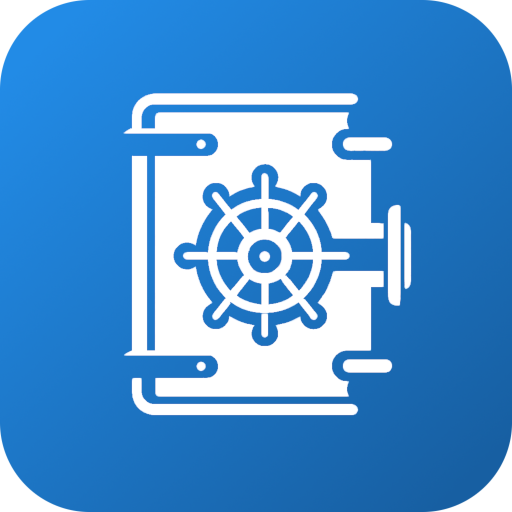

# Book Vault

## Table of Contents

1. [Description](#description)
2. [Folder structure](#folder-structure)
3. [How to run](#how-to-run)
4. [Pages](#pages)
5. [Design](#design)
6. [Dataset](#dataset)
7. [Testing](#testing)
8. [Tech stack](#tech-stack)
9. [How to contribute](#how-to-contribute)

## Description

_Done_

Book Vault is a web-catalogue for books. On it you can browse books of different genres, length, publishers and whatever else you would want to filter your selection by. You can leave reviews on books you have read, and view other peoples reviews to inform your next book pick.

_TODO_

You'll have the opportunity to keep track of books you have read, and which you want to read. You will also be able to keep track of your friends literary journeys by following them

## Folder structure

We are using a monorepo structure with both frontend and backend in the same repository.

## How to run

### Frontend

To start with the frontend, you need to run the following commands:

```
cd frontend
npm install
npm run dev
```

### Backend

[Click here to go to the tutorial on how to run the backend locally](/backend/README.md)

## Virtual Machine

The application is running on a VM at [http://it2810-05.idi.ntnu.no/project2](http://it2810-05.idi.ntnu.no/project2)

## Pages

### Home page

This is our home page. From this page you can navigate to all other pages, as well as view a random book.

|  |
| :------------------------------: |
|          The home-page           |

### Booklist page

On this page you can browse and filter books.

|  |
| :---------------------------------------: |
|             The booklistpage              |

### Book-info page

On this page you can view more info about a book, like average rating, description, genres, ...

You can also leave a review of the book, as well as view other peoples reviews.

|  |
| :------------------------------------: |
|           The book-info page           |

### Reviews page

Here you can view all the reviews you have left on books. The reviews will however be shortened down if they are too long. To read the full reviews you have to click on them and read them on their respective book-info pages.

|  |
| :-------------------------------------------------------: |
|           The reviews page without any reviews            |

|  |
| :--------------------------------------------------: |
|            The reviews page with reviews             |

### User page

Information about user

### Testing page

This page will only be available during development of the website. It can be used to manually test different parts of the website.

**Example test made easier by this page:**

> You want to make sure new users can create reviews

> You want to look at how multiple reviews looks on a book-info page

|  |
| :----------------------------------: |
|           The testing page           |

## Design

### Theme

During the development of this website, we explored various themes to find the most suitable design. Initially, we adopted a dark blue theme inspired by our first logo. However, this theme did not integrate well with the overall aesthetic of the webfsite, leading to a mix of inconsistent themes. Additionally, the original logo contained excessive detail, which we attempted to simplify, but the results were not convincing.

Therefore, we experimented with several new themes, including a beige color scheme intended to evoke a book-like feel. Unfortunately, this theme did not align with the minimalistic design we aimed for and would require a lot of work to change Mantine's light theme and would go against adviced practices with Mantine. Ultimately, we selected a vibrant blue color that complements our minimalistic design approach. To add visual interest, we incorporated a gradient into the theme.

|  |  |
| :-----------------------------------------------------------------: | :--------------------------------------------------------------: |
|                              Old Logo                               |                             New Logo                             |

We also support a light theme and a dark theme. The default theme is based on the user's system preferences, but the user can change the theme manually. Sine we support both themes, we have been careful to use colors that work well in both themes and adhere to WCAG guidelines.

### Accessibility

We have made an effort to make our application as accessible as possible.

**Colors**

We have high contrast between text and background to support people who struggle with varying degrees of colorblindness.

**WAI-ARIA**

Our UI library; Mantine library follows the Accessible Rich Internet Applications Suite (WAI-ARIA) accessibility guidelines. The standard

> ["defines a way to make Web content and Web applications more accessible to people with disabilities. It especially helps with dynamic content and advanced user interface controls developed with HTML, JavaScript, and related technologies. Without WAI-ARIA certain functionality used in Web sites is not available to some users with disabilities, especially people who rely on screen readers and people who cannot use a mouse. WAI-ARIA addresses these accessibility challenges, for example, by defining ways for functionality to be provided to assistive technology."](https://www.w3.org/WAI/standards-guidelines/aria/) (w3.org, 2024)

### Images

The images used on this website were created using DALL-E 3 and Bing Image Creator. These tools generate images that are not subject to copyright restrictions and can be used freely. Since the generated images were not perfect, we utilized the GIMP image editor to adjust them to better fit our website's design. Additionally, to adhere to sustainable web design principles, we compressed the images using the WebP format, with PNG as a fallback for browsers that do not support WebP.

## Sustainability

**TODO: Add data and analytics from lighthouse once the application is done**

## Dataset

Read about how we got the dataset [here](./preprocessing/README.md).

## Test coverage

[_This part is partually copied from the first project_](https://git.ntnu.no/IT2810-H24/T05-Project-1/blob/main/README.md)

We use Vitest with Jest for testing.


**Snapshot tests**

Snapshot tests are a simple way to ensure no unexpected changes are made to components. We are using snapshot tests for most of our components to ensure that we avoid unexpected changes in the generated html.

**Unit tests**

We have unit tests for most of our components. In these tests we check important attributes and functionalities. We however do not test most pages, as the pages mainly just consist of components which are already well tested by unit tests.

**Mocking the API**

We mock the API when we do tests in the frontend. This is mainly done through mocking our hooks as we mainly use hooks to query the API.

## Tech stack


We chose the MERN tech stack with Apollo Client to query the API in frontend. MERN stands for MongoDB, Express, React and Node. The framework of the application is Vite (with TypeScript + React).

We chose MongoDB as our database and not a relational database because of MongoDBs horizontal scalability. We have almost 40 000 books, and almost no relations. Therefore it is more important that the database has the ability to scale well. This also means that relations have to be implemented in resolvers in the backend, as entities and relations in the database are just represented as documents.

Since we want our site to be sustainable we wanted caching in the frontend. This hinders fetching the same information from the database multiple times. This can very easily be done if you use Apollo Client to query the backends API, but then the API has to understand GraphQL. Express with ApolloServer allows us to build such an API.

MongoDB with Express is often combined with either Angular og React. We chose React because we wanted to use the [Mantine UI library](https://mantine.dev/). We wanted to use this library because we wanted to support dark-mode for our application to be more sustainable. Components from this library has light- and darkmode versions, which allows us to support darkmode without too much effort.


**Other notable technologies**

- We use Vitest with Jest for testing.

- We used Pandas (a python library) to clean up our dataset.

## How to contribute

Please read the [DEVELOPER_GUIDE.md](./DEVELOPER_GUIDE.md) to learn how you can contribute to the project.

[Go to top](#book-vault)
